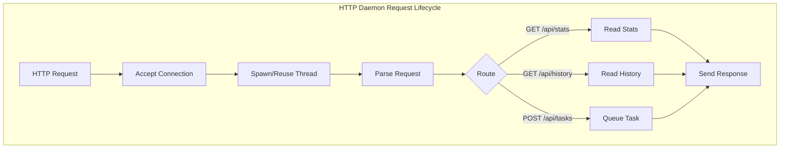
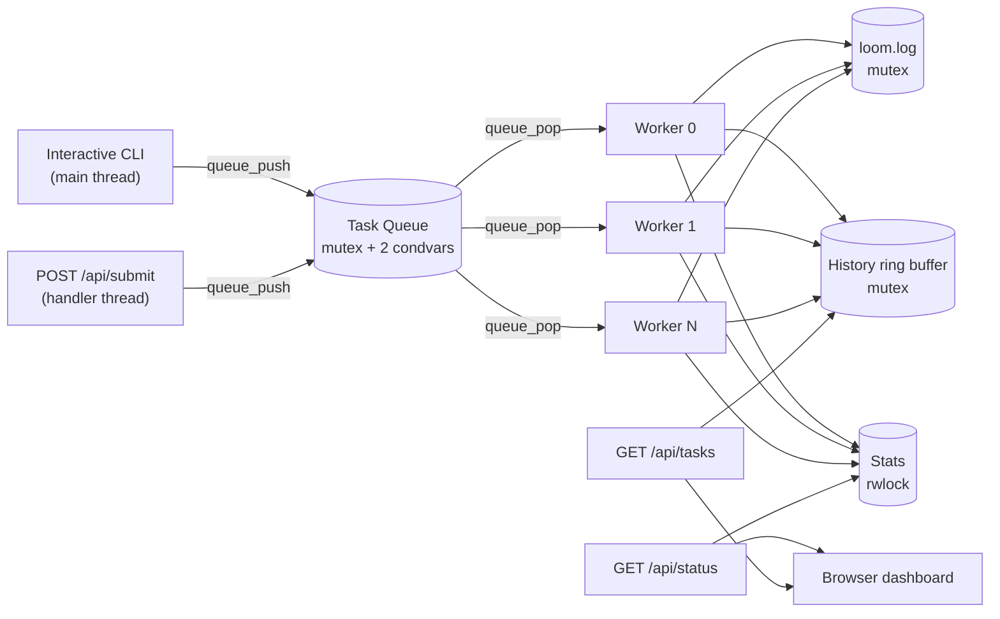
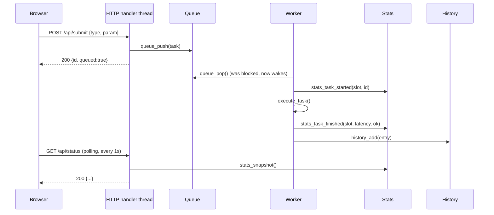

# Architecture & Design

## 1. High-level architecture

Two producers (the CLI and the HTTP `POST /api/submit` handler) feed one
shared queue. A pool of worker threads consumes it. Three independent,
independently-locked shared resources record what happened, and two more
HTTP endpoints read them back out for the dashboard.

## 2. Module breakdown

| Module | Responsibility | Synchronization |
|---|---|---|
| `task_queue` | Bounded FIFO handoff between producers and workers | 1 mutex + 2 condvars (`not_empty`, `not_full`) |
| `thread_pool` | Owns worker threads; runs the task loop; live resize | `count_lock` mutex + condvar for worker bookkeeping; separate `log_lock` mutex for the shared log file |
| `stats` | Aggregate counters + live per-worker state | 1 read-write lock |
| `history` | Ring buffer of the last 50 completed tasks | 1 mutex |
| `http_server` | Accepts connections; serves the dashboard and JSON API | shares the `id_lock` mutex with the CLI for the task-ID counter; otherwise stateless per request |
| `cli` | Interactive `stdin` command loop | uses the modules above; owns no lock of its own |
| `main` | Argument parsing, wiring, signal handling, shutdown | `sigset_t` mask + `sigwait`; a mutex-guarded once-flag for idempotent shutdown |

## 3. Concurrency model

### 3.1 The bounded queue: mutex + two condition variables

`task_queue_t` is a circular buffer of `task_t*`. One mutex guards the
buffer; `not_empty` wakes a consumer when a producer adds work, `not_full`
wakes a producer when a consumer frees a slot. Both waits sit in a `while`
loop, not an `if` -- `pthread_cond_wait` can wake spuriously, and another
thread can beat the woken one to the resource, so the predicate is
re-checked every time control returns.

Shutdown is a flag, not an immediate wake-and-drop: `queue_shutdown()` sets
`shutdown = 1` and broadcasts both condition variables, but `queue_pop()`
still returns any task that is already sitting in the buffer -- it only
returns `NULL` once the queue is **both** empty **and** shut down. That is
what lets `quit` finish already-queued work instead of discarding it.

### 3.2 The worker pool: fixed start, live resize via poison pills

The pool starts with `--workers N` threads. `workers <n>` at the CLI (or an
equivalent resize call) can change that at runtime:

- **Growing** just spawns `(new - current)` more detached threads.
- **Shrinking** pushes `(current - new)` internal `TASK_POISON` entries
  into the same queue real tasks flow through. Whichever worker pops one
  retires immediately. This was a deliberate choice over `pthread_cancel`:
  cancellation can interrupt a thread mid-task, mid-`malloc`, or mid-lock,
  which risks leaks or a permanently-held mutex. A poison pill only ever
  takes effect between tasks, when a worker is not holding anything.

Each worker claims one small "slot" index on start (for the dashboard's
worker grid) and releases it on exit, so the display stays stable and slots
are reused by later-spawned threads.

Full shutdown (`pool_shutdown_and_wait`) is `queue_shutdown()` followed by
waiting on a `live_workers` counter (protected by `count_lock`, decremented
and broadcast by each worker as it exits) until it reaches zero -- the
same mechanism as a targeted resize, just applied to every worker at once.

### 3.3 Stats: a read-write lock, not a mutex

`stats_t` is read far more often (every `status` command, every
`/api/status` poll, once a second per browser tab) than it is written
(once per task start, once per task finish). A `pthread_rwlock_t` lets all
of those readers proceed concurrently and only serializes the occasional
writer, which a plain mutex would not.

### 3.4 The shared log file: one mutex around one resource

Every worker appends a line to `loom.log` when a task finishes. This is the
simplest kind of critical section in the project: one `pthread_mutex_t`
wraps `fputs` + `fflush`, and nothing else touches the file. It is kept
deliberately separate from the stats lock and the history lock even though
all three fire together at task completion, so contention on one never
blocks the other two.

### 3.5 Graceful shutdown: `sigwait`, not a signal handler

`SIGINT`/`SIGTERM` are blocked with `pthread_sigmask` in `main()` **before**
any other thread is created, so every thread inherits the blocked mask. One
dedicated thread calls `sigwait()` on those signals and, when one arrives,
runs the ordinary shutdown function directly. This is the standard way to
avoid writing an asynchronous signal handler: `sigwait()` delivers control
as regular thread code, so it is safe to take locks, `printf`, and close
sockets -- none of which are guaranteed-safe inside a signal handler
invoked asynchronously mid-instruction.

A mutex-guarded `g_shutdown_done` flag makes the shutdown path idempotent,
since both `Ctrl-C` and typing `quit` reach the same function.

### 3.6 Lock ordering: avoided, not managed

The usual advice for avoiding deadlock is "always acquire locks in the same
order." Loom sidesteps the question instead: **no code path in this project
holds two locks at the same time.** Every function that touches a shared
resource acquires exactly one lock, does its work, and releases it before
returning or calling into another module. A worker's task loop, for
example, is a sequence of separate, non-overlapping critical sections
(queue → stats → history → log), never a nested one.

### 3.7 A real bug this design caught: ownership after `queue_push`

Once a task is handed to `queue_push()` and it returns success, a worker
thread can pop, finish, and `free()` that task before the pushing thread's
*next line* of code runs. Early versions of both `submit_task()` (CLI) and
`handle_submit()` (HTTP) read `t->id` for a confirmation message *after* a
successful push -- a use-after-free race that ThreadSanitizer caught during
testing. The fix, applied in both places, is to copy the id into a local
variable before the push. See
[`docs/03-test-plan.md`](03-test-plan.md#4-a-real-bug-found-by-threadsanitizer)
for the full writeup; it is left in this document too because it is the
project's clearest illustration of *why* ownership discipline around
shared pointers matters as much as the locks themselves.

## 4. Sequence: submit → process → dashboard

## 5. Performance considerations

Latency in `/api/status` is measured end-to-end -- from `enqueue_ms` to
`end_ms` -- so it includes time spent waiting in the queue, not just
execution. That is deliberate: it is what makes adding workers visibly
reduce average latency in the dashboard.

Adding workers helps only up to a point. Treat the fraction of a workload
that genuinely runs in parallel as $p$, and the rest -- lock contention on
the queue and the log file, plus any inherently sequential setup -- as
$(1-p)$. Amdahl's law then bounds the speedup from $n$ workers:

$$
S(n) = \frac{1}{(1-p) + \dfrac{p}{n}}
$$

As $n \to \infty$, $S(n) \to \frac{1}{1-p}$: a hard ceiling set entirely by
the serial fraction, no matter how many workers are added. This is
directly observable with the CLI: run `workers 1` then `batch 20` and note
how long it takes to drain (`status` until queue depth returns to 0);
compare against `workers 8` then `batch 20`. CPU-bound `prime` tasks with a
large parameter should scale close to linearly (little shared state per
task); a `batch` full of small `fileio` tasks scales worse, since every one
briefly contends for the same log mutex.

## 6. Design trade-offs and known limitations

| Decision | Trade-off |
|---|---|
| Hand-rolled JSON (a couple of `strstr` calls), not a library | Zero dependencies, but only handles the project's own fixed request/response shapes -- not general JSON |
| One thread per HTTP connection, not an event loop | Simple and easy to reason about; would not scale to thousands of concurrent connections, which a monitoring dashboard never needs |
| Task history capped at 50 entries in memory | Older completed tasks are still in `loom.log`, just not in `/api/tasks` |
| No TLS/authentication on the HTTP server | Fine for localhost/trusted-network use; not meant to be exposed publicly |
| Worker "slot" index is cosmetic | It identifies a position in the dashboard grid, not an OS thread ID -- slots are reused after a worker retires |
